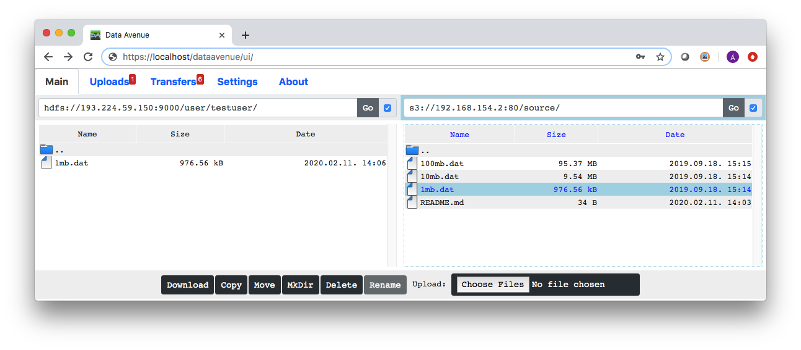
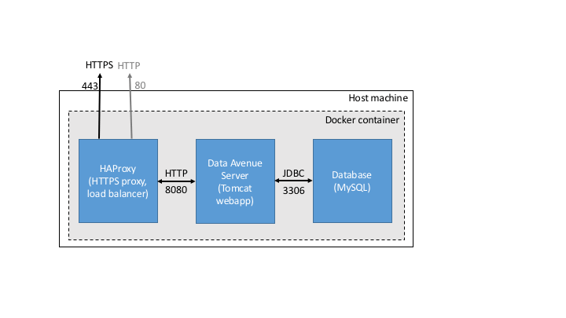

# IN ALPHA TESTING

# Data Avenue

## About

Data Avenue is a **data storage access tool** that aims at simplifying handling data residing on remote storages of various types, such as FTP servers, Amazon S3, Hadoop Distributed File System (HDFS), OpenStack's Swift, etc. **Data Avenue is not a storage**, it does not persist any data at all (neither access credentials), but it allows you to **upload, download, organize** data (create
folders/containers/buckets, delete files or entire directories, etc.), and even **transfer** data between any of the supported storage types, e.g. from S3 to HDFS.

Data Avenue offers a **uniform and easy-to-use interface** to access all the supported storage types. E.g., directory creation can be done in the same way regardless it happens on a GridFTP server or on Amazon S3 - from the user's point of view.
There is lightweight, pure javascript-based **graphical user interface** (GUI) that can be used in any web browser, 
and there is a clean **REST application programming interface** (API).

Having Data Avenue you don't have to deal with downloading, installing, configuring, and getting to know the proper tools (e.g., command-line tools, proprietary tool, api libraries) to access a particular storage. Also, no worry about local disk space, when transferring huge amount of data from one storage to another. 

Developed by the [Laboratory of Parallel and Distributed Systems](https://www.sztaki.hu/en/science/departments/lpds) (LPDS) of [Institute Computer Science and Control](http://www.sztaki.hu). 

2020, [Apache license](LICENSE)

## Publications, projects

- Akos Hajnal, Eniko Nagy, Peter Kacsuk and Istvan Marton: Data Migration for Large Scientific Datasets in Clouds, Azerbaijan Journal of High Performance Computing, Vol 1, Issue 1, 2018, pp. 66-86, https://doi.org/10.32010/26166127.2018.1.1.66.86
- Hajnal A, Marton I, Farkas Z, Kacsuk P: Remote storage management in science gateways via data bridging, CONCURRENCY AND COMPUTATION: PRACTICE AND EXPERIENCE 27:(16), pp. 4398-4411, 2015
- Hajnal, A., Farkas, Z., and Kacsuk, P.  Data Avenue: Remote Storage Resource Management in WS-PGRADE/gUSE, 6th IEEE International Workshop on Science Gateways (IWSG), pp. 1-5, 2014
Hajnal A, Farkas Z, Kacsuk P, Pinter T: Remote Storage Resource Management in WS-PGRADE/gUSE. In: Kacsuk P (ed.), Science Gateways for Distributed Computing Infrastructures: Development Framework and Exploitation by Scientific User Communities. 301 p., Springer, 2014, pp. 69-81. (ISBN:978-3-319-11267-1)

Projects in which Data Avenue were actively used:

- Cloudification of Production Engineering for Predictive Digital Manufacturing (CloudiFacturing), EU Horizon 2020, 768892, 2017-2021
- Cloud Orchestration at the Level of Application (COLA), EU Horizon 2020, 731574, 2016-2019
- ViaLactea - The Milky Way as a Star Formation Engine, EU FP7-Space, 607380, 2013-2016

## Try it

You can use docker(-compose) to launch Data Avenue. 
On Ubuntu (similar in other distros):

``sudo apt-get update; sudo apt-get install git maven openjdk-8-jdk docker-compose``

``git clone https://github.com/SZTAKI-LPDS/data-avenue.git``

``cd data-avenue``

``mvn clean package``

``cp data-avenue.core.war/target/dataavenue.war data-avenue.docker-compose/dataavenue/webapps/``

``cd data-avenue.docker-compose``

``sudo docker-compose up -d``

## GUI

The GUI is available at: 

[http://localhost/dataavenue/ui/](http://localhost/dataavenue/ui/) 

or 

[https://localhost/dataavenue/ui/](https://localhost/dataavenue/ui/)

To browse an HTTP server, you can try "URI" http://xenia.sote.hu/pub/mirrors/www.apache.org/tomcat/, press Go, then choose: "No authentication". 

## REST API

You can use Data Avenue from shell scripts (e.g. ``curl``, ``wget``) or from program codes; you can also automate
data manipulations with ``chrontab`` (regular backups, etc.).
See the full documentation here: [REST API](docs/rest/API_specification_DataTransferAndBrowser_v0.1.2.pdf).

### Uniform Resource Identifiers - URIs

In Data Avenue, every file (object, blob, ...) and directory (bucket/folder/container whatever they called on the particular storage) is referenced by URIs. 
This is what you need to access a file/directory on a storage, which has the form: ``protocol://host/path``. ``protocol`` is the type of the storage like: s3://, sftp://, 
srm:// (see: [https://localhost/dataavenue/index.html](https://localhost/dataavenue/index.html) for the list of supported protocols). ``host`` is the domain name or IP address of the storage e.g. aws.amazon.com. 
``path`` is the path of your file or directory (in the latter case, URI end with a slash), e.g. /mybucket/myfolder/myblob.dat, /home/myuser/mydir/. Optionally, you can add ``port`` to host: host:80. (If using S3 storage over http, you must explicitly set port 80; but not recommended for security reasons.) 

### Data Avenue key (a.k.a. key, access key, ticket)

To use Data Avenue services you have to have an access key, which must be set in the UI in the Settings tab or passed as "x-key" HTTP header in every REST API call. By default, a single key: "dataavenue-key" is created automatically on start up.
This key can be changed or disabled in the data-avenue.core.war/src/main/resources/dataavenue.properties file.
Basically, you can create as many keys as you want, in the Ticket table in the database. You might want to create 
different keys for different users in a multi-user environment in order to track who did what, if needed.

## Architecture

Data Avenue comes with three components:
* Data Avenue server (running in Apache Tomcat as webapp 'dataavenue'), which connects to different storages and the user
* Database (MysqlServer to persist some data about users, transfers)
* Proxy (HAProxy to open port 80 (http) and 443 (https) to connect the user to Data Avenue)

The proxy uses a self-signed certificate: data-avenue.docker-compose/haproxy/dataavenue.pem. Replace it with the certificate of your choice.

## History

The long story short: in about 2014, we needed a solution to handle data for Grid computations and connect to storages like GridFTP, 
SRM, LFN, iRODS, HTTP without the need of getting client api libraries. Data Avenue did this job nicely, it took burden of interfacing and communicating with these storages
in their proprietary protocols, and from now on, computations only had to use the single interface of Data Avenue to read/write data on storage resources.  
The development of Data Avenue continued towards clouds with adding protocols Amazon S3, Swift (for OpenStack), and is still in progress to support Azure, Google clouds, and whatever comes in the future.  
 

## Security

To access a storage you have pass credentials (password, secret key, etc.) to allow Data Avenue to connect to it. 
These credentials are not stored anywhere other than in memory and only for the time of the data transfers.
Don't trust us? You are totally right, check the source codes. (And report to us any potential leak if you find one.)
Always use https to connect to Data Avenue when you are on unprotected network. (A HAProxy container also deployed.) Connections between Data Avenue and the storages 
are safe (due to storage protocols, typically over https, such as with S3 or SFT).

## Source codes

All up here. Long history, time pressure, diverse user requirements, you know how it is going, but you can even find comments occasionally.

  
## Adapters (ak.a. adaptors, plugins)

### S3 adaptor (data-avenue.adaptors.s3): s3://

Probably this is the most mature and most tested adapter. Tested on Amazon, Ceph Rados and Minio.
Supports multi-threaded upload (multithreaded download under development), supports redirect URL to download directly (without relaying the data through Data Avenue server) and server-side transfers (e.g. at moving data between buckets/folders on the same
Amazon region).

### HDFS adaptor (data-avenue.adaptors.hdfs): hdfs://

This plugin connects to Apache Hadoop Distributed File System (HDFS).
Via this plugin you can upload/download files to/from HDFS, create folders, etc.

### JSAGA adaptor (included in data-avenue.core.service): http://, https://, sftp://, gsiftp://, irods://, lfn://, srm://

This was the very first adaptor built on top of JSAGA (Java implementation of Simple API for Grid Applications (SAGA) specification from the Open Grid Forum (OGF)) developed by IN2P3 Computing Center).
It supports various protocols: sftp, GridFTP (gsiftp), irods, lfn (LHC file system), srm (Storage Resource Management), and some others.
Thanks again for the support of IN2P3 team! 
The code of this adapter is not separated for core service (to be done).  
This adaptor was tested on various storages, but less and less legacy storages are available today. 

### JClouds adaptor (data-avenue.adaptor.jclouds): swift:// (, azure://, google://)

This plugin aims at accessing storage supported by Google's "jsclouds" API, which includes Swift, Azure and Google cloud.
We tested only swift (storage of OpenStack clouds) connection with keystone authentication (version 3).
Only protocol swift:// is among the supported types (other protocols were not tested, and so commented out in the code).

### GSS adaptor (data-avenue.adaptor.gss): gss:// - Experimental

This plugin aims at accessing HPC storages through a so called Generic Storage Service (GSS) API.
Probably, you don't have access to such an API/storage.

### Cassandra adaptor (data-avenue.adaptor.cassandra): cassandra:// - Experimental

This was an experimental development of a plugin that can be used to access/read Apache Cassandra databases, read keyspaces, tables as "directories" and "files" (with
size corresponding to the number of rows), and even download table contents (key-value pairs) in JSON format.
Fragment part of the URI specified the maximum size of the result set, with query part of the URI was used to specify keys of interest,
Various types of Cassandra (primitive, list, set, map) are handled by the plugin at creating the corresponding JSON content.
It was tested on a Cassandra instance, but you probably will not use to access databases in this way anyway.

## Obsolete modules (recycle bin): wsclient, restclient, adaptor.cdmi, adaptor.drive

These modules are not compiled, packaged, added anymore.
Sources are still kept, just in case, to have something to start from if any of below is going to be used again.

### Web service client, REST client - Obsolete

SOAP-based web service is not provided anymore. Difficult to maintain, extend, change, client required, 
verbose xml, etc. Use REST!

Explicit REST client is not maintained anymore (the code out there would require updating to newer Jersey). 
REST API/service is simple enough to use directly from other APIs offering REST calls (such as Jersey), 
no need to have a Java wrapper to call REST.

### CDMI (data-avenue.adaptor.cdmi) cdmi://, cdmis://- Obsolete

Standardized data access in clouds called Cloud Data Management Interface (https://www.snia.org/cdmi) looked promising.
This plugin started to integrate it into DataAvenue but early discontinued due to operational servers/functional/support/community deficiencies.
Was never complete, didn't work well ever, not in supported protocol list, code fractions are still here.

### Drive (data-avenue.adaptor.drive) drive://, ... - Obsolete

This plugin aimed at accessing Google drive (potentially also s3, azure, hp, ... other resources) using Google drive API.
Only the skeleton of the plugin is available, no functions are operational at all. Code fractions are here, implementation interrupted and discontinued.
Not included in supported protocols.

                                                                                                                                      s